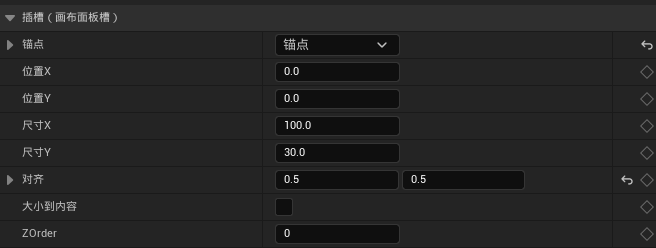

# UMG中锚点的作用

- **锚点为坐标轴原点**  
  右边为X轴正方向，下边为Y轴正方向。

- **位置X和位置Y**  
  表示Widget距离锚点原点的偏移距离（单位：像素）。

- **对齐（Alignment）**  
  - 定义Widget的**对齐基准点**，范围从 `(0,0)` 到 `(1,1)`：  
    - `(0,0)`：以Widget的**左上角**对齐锚点  
    - `(1,1)`：以Widget的**右下角**对齐锚点  
  - 例如：对齐值为 `(0.5,0.5)` 表示以Widget中心对齐锚点。

