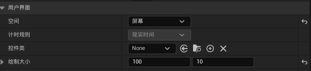

# 为敌人绘制血条

## Step1 设置UMG

添加如下格式：

并将进度条设置修改为：

绑定函数实现如下：

注：其中Enemy变量应该设置为公开，然后将细节面板中的生成时公开勾选

## Step2 给敌人添加控件组件

将细节面板->用户界面->空间修改为屏幕，将绘制大小修改为Step1的进度条同样大小

在敌人的蓝图BeginPlay事件后面添加

## Step3 敌人死亡时销毁UMG

在设置IsDeath的逻辑后面添加如下逻辑（一定要考虑到会不会重复触发destroy！！！）：

