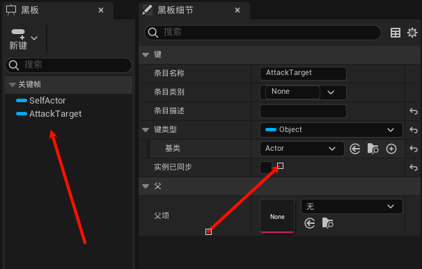
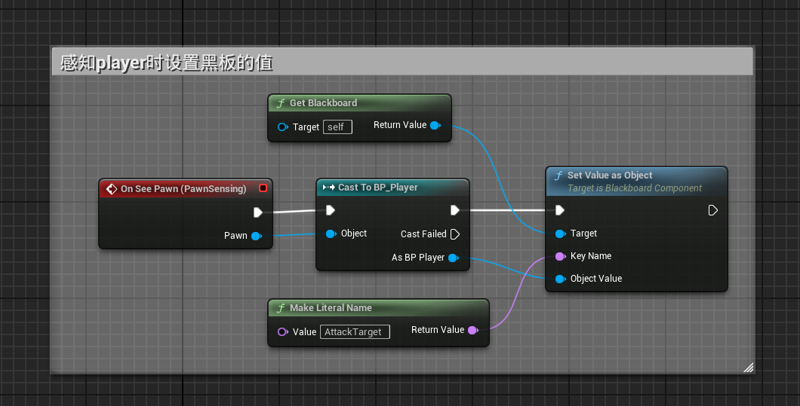
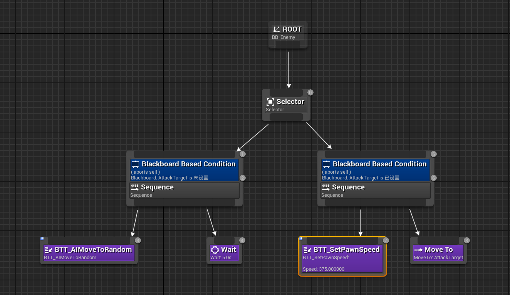
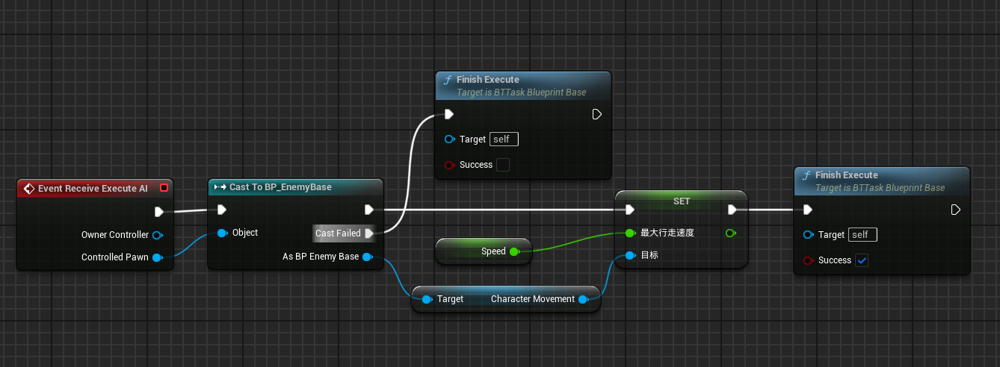

# 实现敌人感知Player功能

[前文：设置行为树](./设置行为树.md)

## Step1 给敌人蓝图添加PawnSensing组件
## Step2 黑板添加键值

- 在黑板中创建`AttackTarget`键（Key类型：Object | 基类：Actor）

## Step3 感知时设置黑板的值

> **注**：`On See Pawn`事件从PawnSensing组件的细节面板获取
- 绑定`On See Pawn`事件
- 通过`Set Blackboard Value as Actor`节点更新AttackTarget值

## Step4 设置行为树

1. **添加装饰器条件**：
   
   - 右键节点选择"添加装饰器->Blackboard"
   - 根据所需功能设置黑板条件
   
   **注**：
   
   - 黑板细节面板：流控制->观察者中止选择为`Self`（立即中止当前分支）
   - MoveTo节点需设置黑板键为`AttackTarget`
   
3. **速度控制节点**：

图中`BTT_SetPawnSpeed`节点逻辑如下：

- 通过`Set Max Walk Speed`节点调整移动速度

[后文：事件分发器](./事件分发器.md)
