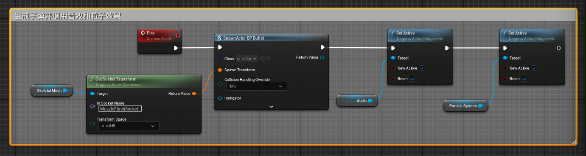

# 开火功能设计

## Step1 
- 角色设置IA_Fire并添加到Input Mapping Context

## Step2 
- EnhancedInputAction IA_Fire 事件调用时：
  - 调用武器的Fire（自定义）事件
  - 播放相应的蒙太奇动画（PlayMontage）

## Step3 
- 武器Fire事件触发后：
  - 在枪口骨骼插槽生成子弹
  - 生成烟雾粒子效果（Cascade）
  - 生成音频效果

**注：**

- 子弹记得设置发射移动组件（ProjectileMovement)
- 设置音频和粒子初始不播放，在开火时触发
- SetActive中的NewActive是想要设定的活跃状态，reset引脚是设置如果Target目前在working，是否强行重置重新播放（如果NewActive为True的情况下）

例如：

## Step4 
- 设置子弹的速度等属性和蓝图

