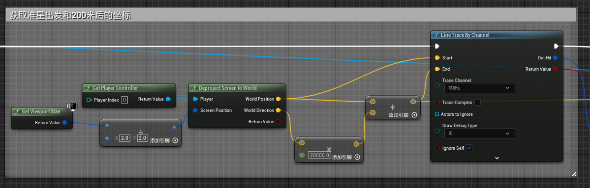
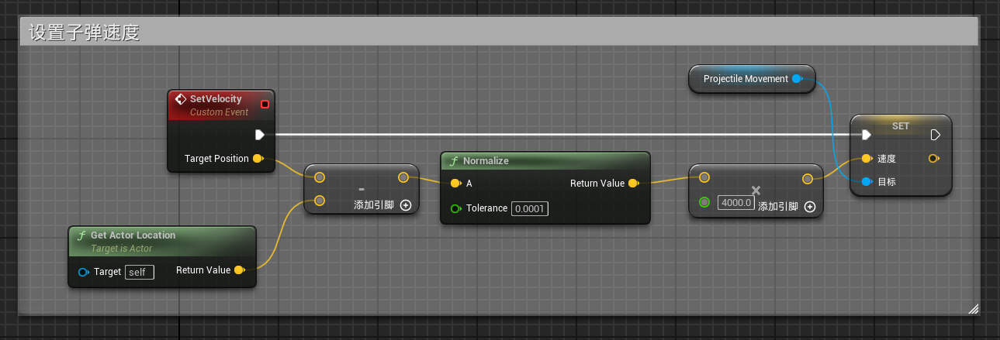
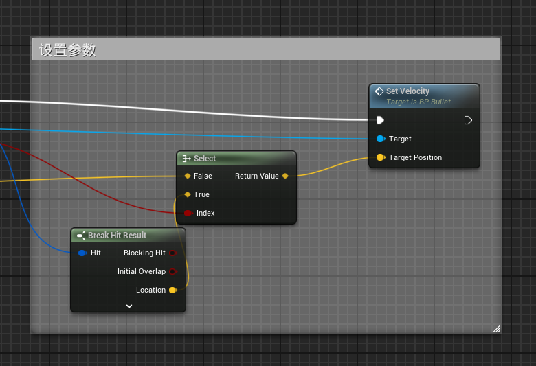

# 开火设计优化

前文设计的开火虽然符合正常逻辑，但是会发现 bullet 并非朝向 viewport 的准星进行发射，本文主要就是对该问题进行修复。

---

## Step1 获取准星处 World 坐标和发射两百米后的 World 坐标

节点用法查询 [蓝图功能.md](./蓝图功能.md)  

---

## Step2 Bullet 设置 SetVelocity 事件

---

## Step3 根据 Line Trace 是否发生碰撞设置参数

图中浅蓝色线为前文生成的 bullet 对象，连接到 Select 的 **False 引脚**的是前文计算的 200 米后 Target Position  

