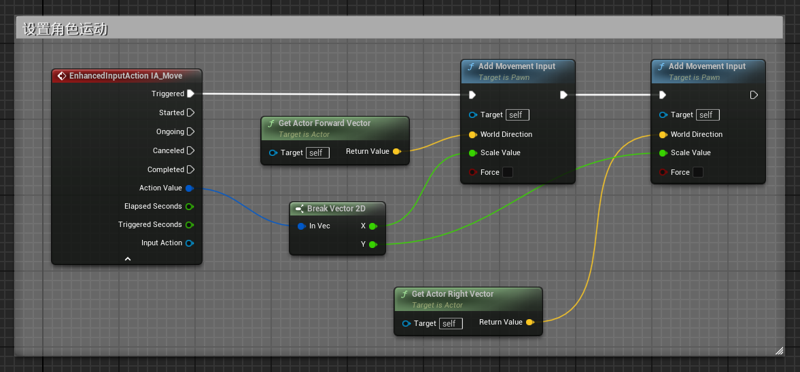

# 设置角色运动（增强输入 Enhanced Input）

## Step1：设置输入操作
- 示例操作设置：
  - `IA_Move`（值类型：Vector2D）
  - `IA_Look`（值类型：Vector2D）
  - `IA_Jump`（值类型：bool）

---

## Step2：配置输入映射
**添加输入映射上下文**（蓝图->输入->输入映射上下文）

- 配置界面：  

> **注：**
>
> - 未设置修改器时，所有操作方向相同
> - 修改器中"否定"可使值取反
> - "拌合输入轴值"可切换轴向（xAxis ↔ yAxis，前 → 右）

---

## Step3：注册增强输入
1. **在角色蓝图中注册输入系统**  
   

2. **绑定输入事件到角色运动逻辑**  
   示例运动绑定实现：  
   
