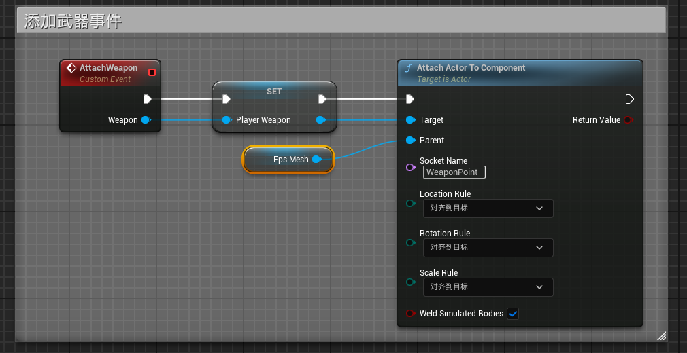
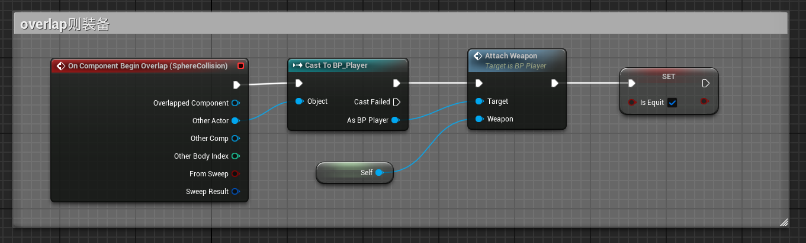

# 绑定武器

## Step1 设置 Weapon

1. **在角色骨骼上添加插槽**  
   - 右键骨骼节点 → **添加插槽**（Socket）。  
   - 命名插槽（如 `Weapon_Socket`）。

2. **配置插槽预览**  
   - 右键插槽 → **添加预览资产** → 选择武器的骨骼网格体（Skeletal Mesh）。  
   - 在预览场景中调整参数：  
     - **动画** → **预览控制器** → 选择特定动画资产（用于调整姿势）。  
   - 调整插槽的 **位置/旋转/缩放**，避免武器与角色模型穿模。

---

## Step2 角色设置 AttachWeapon 事件

1. **添加变量与事件**  
   - 在 `BP_Player` 蓝图中添加变量：  
     - 变量类型：`BP_PlayerWeapon`（武器蓝图类）  
     - 变量名：`EquippedWeapon`  
   - 右键蓝图图表 → **添加自定义事件** → 命名为 `AttachWeapon`。  
   - 设置事件输入参数：`WeaponToAttach`（类型为 `BP_PlayerWeapon`）。

2. **配置附加逻辑**  
   
   - 事件逻辑示例：  
       
   - **Rule 引脚选项说明**：  
     | 选项           | 行为                                       |
     | -------------- | ------------------------------------------ |
     | `KeepRelative` | 保持相对位置（基于父组件的局部坐标系偏移） |
     | `KeepWorld`    | 固定在世界坐标系（不随父组件移动）         |
     | `SnapToTarget` | 对齐到目标插槽原点（直接绑定到骨骼位置）   |

---

## Step3 调用 AttachWeapon 事件

1. **在武器蓝图中触发绑定**  
   - 当武器的碰撞体（Collision）触发 `Overlap` 事件时，调用 `AttachWeapon`将武器附加到角色的插槽。  ：  
       
     
     
