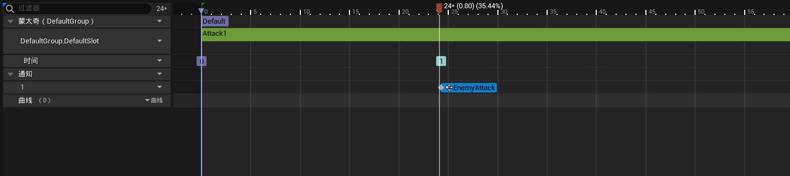
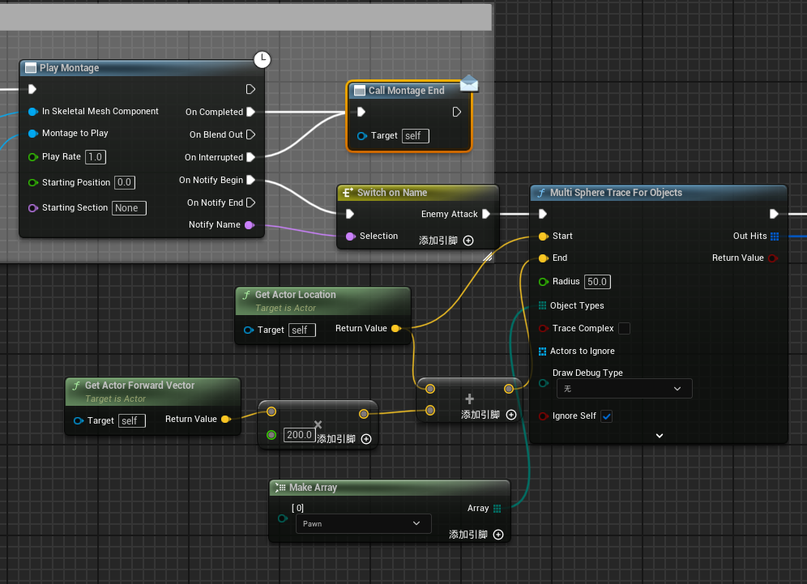
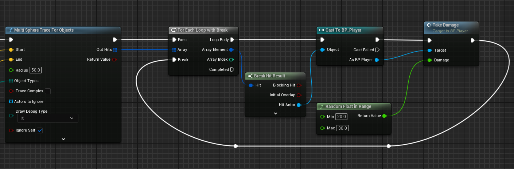

# 蒙太奇通知

> 本篇并非专门讲蒙太奇通知，而是利用蒙太奇通知实现敌人攻击时触发伤害的功能。

### Step1 在蒙太奇中的通知轨道添加蒙太奇通知

### Step2 实现角色蓝图的TakeDamage事件

### Step3 进行攻击检测

将`SwitchOnName`引脚设置为蒙太奇通知对应的名字，并用`MultiSphereTraceForObjects`获取攻击范围内目标数组

接着将获得的数组遍历寻找角色蓝图

