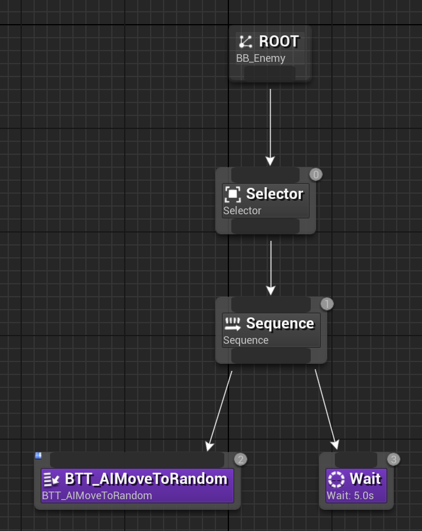
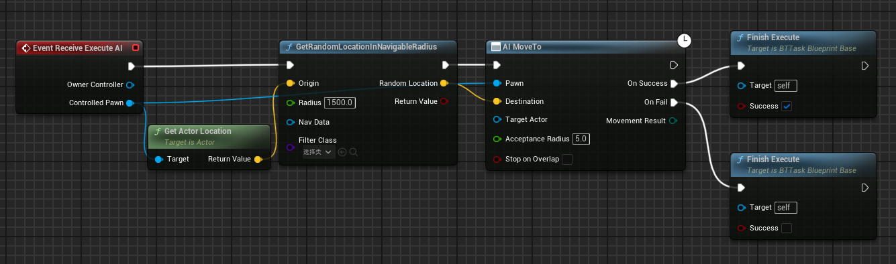
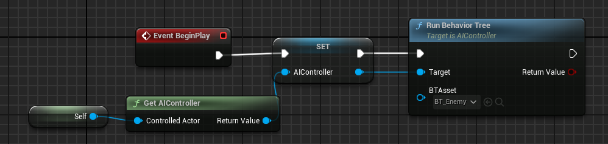
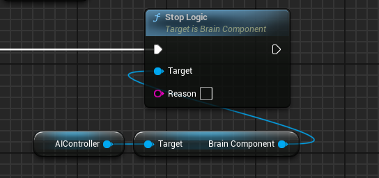

# 设置敌人的行为树

## Step1 设置BT蓝图逻辑（编写相关逻辑）

> 图中`BTT_AIMoveToRandom`节点为自定义节点，逻辑如下：
> - **注意**：Receive Execute AI节点需要以Finish Execute节点结束
> - 使用`GetRandomLocationNavigatableRadius`节点需要设置导航网格体边界体积（NavMeshBoundsVolume）

## Step2 在敌人蓝图运行行为树

[后文：实现敌人感知Player功能](./实现敌人感知Player功能.md)

## 附加：停止行为树运行

